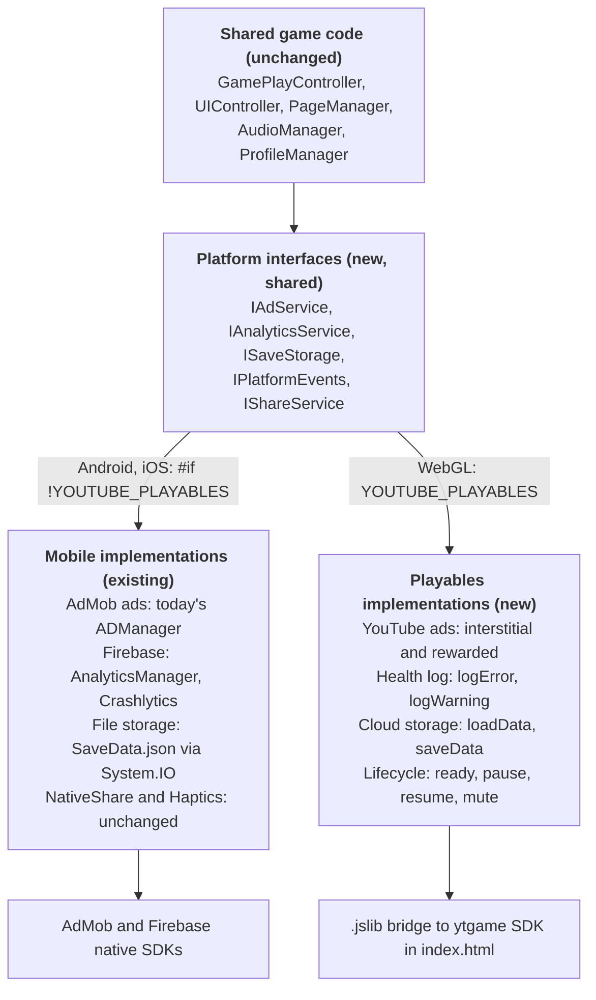

# FreeFlow — YouTube Playables: Implementation Plan

As of 2026-10-07 · Companion: [YOUTUBE_PLAYABLES_REQUIRED_CHANGES.md](YOUTUBE_PLAYABLES_REQUIRED_CHANGES.md) · Live doc: https://claude.ai/code/artifact/26f66072-79d7-4210-930e-042b1cc004cd

## Goals and non-negotiables

Ship FreeFlow as a certified YouTube Playable from the same Unity project as the Play Store and App Store builds, without changing how the mobile builds behave. The work happens on a separate branch and is merged back.

Goals:

- A WebGL build that passes Playables certification on desktop web, mobile web, YouTube Android and YouTube iOS.
- Player progress (pack levels, daily completions, hints, settings) kept in YouTube cloud save.
- YouTube interstitial and rewarded ads built in place of AdMob behind a switch, turned on only if Google confirms they serve; hints refill +1 per daily challenge solved, so they never depend on ads.

Non-negotiables:

- Mobile code paths, SDKs, packages and settings stay as they are; Playables code is added behind `YOUTUBE_PLAYABLES`.
- No package is removed from the project; mobile-only packages are excluded from the WebGL build by define symbols and plugin import settings.
- Every Playables change is checked against an Android build before merge.

## Architecture

Add a thin platform layer: game code calls interfaces, and the build target decides whether the mobile or the YouTube implementation sits behind them.

Only the Playables column and the interfaces are new; the mobile column is today's code moved behind an interface.

**Define and build profile.** `YOUTUBE_PLAYABLES` is set only on the WebGL target, together with `FINAL_BUILD` for submission. A "YouTube Playables" Build Profile (Unity 6) holds the WebGL template, compression Disabled, data caching off, High stripping and the define, so switching store never means hand-editing Player Settings.

**Keep mobile classes compiling.** `ADManager`, `FirebaseManager` and `AnalyticsManager` stay as classes on both targets, because StartScene and `GameBootstrap.initializationOrder` reference them. Only the SDK calls inside are wrapped in `#if !YOUTUBE_PLAYABLES`; on WebGL their `Initialize` just calls back. This avoids missing-script components and keeps one scene for every store.

**Save storage.** `ProfileManager` keeps its in-memory cache and JSON format; only the backend changes. `ISaveStorage` has `Load(Action<string>)` and `Save(string)`. Mobile writes the two files as today; Playables merges `PlayerProgress` and `SettingsData` into one JSON envelope with `schemaVersion` and calls `saveData`. The existing async `Initialize(Action)` seam waits for `loadData` before MainScene loads.

**JS bridge.** Start from Google's [Unity wrapper](https://developers.google.com/youtube/gaming/playables/samples/unity_wrapper) (`.jslib`, `YTGameWrapper.cs`, template) Inspected on 2026-10-07: it already wraps every call FreeFlow needs except `getLanguage` and `openYTContent`, and calls back through `SendMessage` to a `DontDestroyOnLoad` object that must be named `YTGameWrapper`. Three gaps to cover in our code: don't trust the int status from the save or interstitial calls, put a timeout around `loadData` (it has no failure path), and don't rely on the Editor rewarded-ad stub (it always grants). Files: `Assets/Plugins/WebGL/` for the jslib, `Assets/WebGLTemplates/YouTubePlayables/` for `index.html`.

**Editor fake.** A `FakePlayablesService` stands in for the jslib in Play mode, with Inspector buttons for pause, resume and mute, so lifecycle code is testable without a browser.

## Work plan

Six phases, about 20 to 26 developer-days for one Unity developer, plus the certification review wait. Estimates are Claude's from the codebase survey, not measured and not yet agreed with the team; Phase 0 exists to correct them early.

| # | Phase | Main tasks | Estimate | Done when |
| --- | --- | --- | --- | --- |
| 0 | Access and spike | Apply via the Playables interest form; throwaway branch: guard Firebase and AdMob, build WebGL once, load it in the Test Suite, record `.data`/`.wasm` sizes | 2–3 days | First real size number; game boots in the Test Suite |
| 1 | Platform layer and build profile | `YOUTUBE_PLAYABLES` define; Build Profile; interfaces; move `ADManager`, Firebase and file I/O behind them; import Google's Unity wrapper and template; Editor fake | 4–5 days | Android build behaves as before; WebGL compiles with no mobile SDK code |
| 2 | SDK lifecycle and cloud save | `ISaveStorage` on `loadData`/`saveData` with one versioned JSON envelope; wait for load before MainScene; `firstFrameReady`/`gameReady`; pause/resume freeze and save flush; YouTube mute in `AudioManager`; music after first input; `targetFrameRate = -1` on WebGL | 4–5 days | Test Suite pause, resume, mute and save checks pass |
| 3 | UI and policy fixes | Hide Share, Privacy and Vibration rows; Esc closes overlays through `PageManager`; pillarbox up to 32:9 and check 9:32; end-of-content message; YouTube ads behind `IAdService` and a switch (off until Google confirms ads serve), with today's 3-level/180 s gating; +1 hint per daily solved | 4–5 days | Every Design MUST in the Required Changes doc passes by hand |
| 4 | Size and performance | Re-encode `bg-music`, drop unused Teko SDF weights, exclude unreferenced `__Sprites/screens`, compress large backgrounds, High stripping, data caching off; measure load time and heap on phones | 3–4 days | Under 15 MiB to `gameReady`; interactive under 5 s on mid-range Android |
| 5 | Test and submit | Full testing plan; Developer Portal release, metadata, thumbnails, ad settings; fix findings; submit | 3–4 days + review | Submitted for certification |

Phases 1 and 2 are the only ones that touch shared code; review each of them with an Android and iOS build before merging. Phases 3 and 4 change only Playables-guarded UI and WebGL-only import settings.

## Testing plan

Every release candidate goes through four layers, cheapest first.

| Layer | How | Pass criteria |
| --- | --- | --- |
| Editor | Play mode with a fake `ytgame` service (no jslib) | Boot waits for load; pause freezes play; mute silences all audio |
| Local browser | WebGL build served locally, YouTube CSP applied with Chrome local overrides ([guide](https://developers.google.com/youtube/gaming/playables/reference/test_suite_guide)) | No CSP violations in console; no external requests in the Network tab |
| Playables Test Suite | Build loaded into the [Test Suite](https://developers.google.com/youtube/gaming/playables/test_suite) (the Developer Portal links it per release) | Unverified: the page does not load without portal access, so what it checks beyond CSP is unknown |
| YouTube dev link | Developer Portal release, "Verify and test" tab | Works on the four platforms the portal lists: YouTube desktop web, mobile web, Android and iOS, in all YouTube-supported browsers |

Budgets checked on every build (the device and network conditions are proposed test setups, not Google rules):

- Bytes downloaded until `gameReady`: under 15 MiB target, 30 MiB hard limit (Network tab, cache disabled).
- Largest file under 30 MiB; total file count under 8,000; filenames only letters, digits, `_ - .`.
- Interactive in under 5 seconds on a mid-range Android phone over 4G throttling.
- JS heap well under 512 MB on an iPhone after 20 levels.
- Save payload size logged; target under 500 KiB.

Scenarios to run by hand:

- [ ] First launch with no save, then reload: pack progress, daily completions, hints and settings restored
- [ ] Save from an older build version loads without errors
- [ ] Resize from 9:32 to 32:9 mid-level: board stays playable, no state lost
- [ ] Draw every flow with mouse only, then with touch only
- [ ] YouTube mute on: no sound anywhere, including the first tap and ad close
- [ ] Pause during a level and during an ad, then resume
- [ ] Esc closes every popup
- [ ] Daily challenge across midnight and on Feb 29
- [ ] Last level solved: an end-of-content message appears
- [ ] Rewarded ad declined or unavailable: no reward, no stuck UI
- [ ] Solving a daily challenge adds 1 hint on YouTube; the mobile build is unchanged
- [ ] Android build of the same commit still shows AdMob ads, share and haptics, and logs Firebase events

## Risks and open questions

The biggest open risk is whether YouTube ads serve at all. Hints no longer depend on them: the YouTube build grants +1 hint per daily challenge solved.

| Risk | Impact | Mitigation |
| --- | --- | --- |
| YouTube ads not available: the requirements page says monetization is not supported, the portal says ad settings "won't change the end-user ads experience for now", and `requestRewardedAd` makes no guarantee an ad was shown | No ad revenue on YouTube | Decided: ads built behind a switch, off until Google confirms; hints refill through daily solves |
| Early-access application not accepted, or slow | Work done with no launch slot | Apply in Phase 0, before Phases 1 to 5 |
| Initial download over 15 MiB (on-disk sizes suggest it is close) | Slow first load, weaker certification | Phase 0 measurement; lazy-load music; trim fonts and sprites |
| iPhone memory: WebGL max memory is set to 2048 MB today | Crash in YouTube iOS above 512 MB heap | Lower max memory on the WebGL target; test 20+ levels on an iPhone |
| "Substantially identical" and trade-dress rules in Trust and Safety | Rejection if Pathza looks too close to existing flow-puzzle games | Review title, thumbnails and colour style before submission |
| Shared-code refactor in Phases 1 and 2 | Mobile regression | Android and iOS smoke test before each merge; save-format tests in `Assets/Tests/Editor` |
| Old saves after updates (cloud saves must load across versions) | Lost progress | Keep `schemaVersion` migration in the envelope; test loading a save from the previous build |
| No Firebase analytics on YouTube | No level funnel data for the Playables build | Accept for launch; use Developer Portal metrics if offered |

Open questions:

- [x] Ads: build YouTube ads behind a switch; turn on only if Google confirms they serve (decided 2026-10-07)
- [x] Hint refill on YouTube: +1 hint per daily challenge solved (decided 2026-10-07)
- [x] Branch: Playables work on a separate branch, merged back (decided 2026-10-07)
- [ ] Ask Google (Playables Discord or your contact) whether YouTube ads currently serve
- [ ] Is the license for `bg-music.wav` and the SFX valid for distribution on YouTube?
- [ ] Send a score with `sendScore` (for example total levels solved), or skip it?
- [ ] Add more languages now via `getLanguage`, or English only for v1?

Found during the survey, unrelated to Playables: `UIController.RetryCurrentLevel` always built the pack path, so Retry on a Daily level loaded the Classic level with the same number. Fixed on 2026-10-07 in commit `0707991`: Retry now reloads a daily level from its Daily folder. Also found: `FINAL_BUILD` is not defined on any target, so the Developer row (which can set hints) shows in current Play Store and App Store builds too.

## Submission checklist

Tick these in the Developer Portal release before pressing "Submit for Certification"; only one release can be in review at a time.

Access and listing:

- [ ] Studio accepted through the Playables interest form; YouTube channel onboarded
- [ ] Team members given Editor or Manager permission on the channel in YouTube Studio
- [ ] Title, genre, description, publisher and developer filled in, with no logos or branding in thumbnails or text
- [ ] Thumbnails exported in every aspect ratio the portal asks for
- [ ] Accurate accessibility tags selected
- [ ] Rights confirmed for all art, fonts, music and SFX; listing is general audience 13+, not made for kids
- [ ] Interstitial and rewarded ad settings chosen in the portal

Build:

- [ ] ZIP of the WebGL output, built with Compression Disabled; folder layout checked against the portal's upload rules (not yet confirmed)
- [ ] SDK script is the first script in `index.html`
- [ ] Under 30 MiB to `gameReady`, under 250 MiB total, under 8,000 files, every file under 30 MiB
- [ ] Relative paths and safe filenames only
- [ ] No external requests, no AdMob or Firebase code in the bundle
- [ ] No share buttons, privacy-policy row, vibration toggle or external link in the UI
- [ ] No in-game master mute; music and SFX toggles still work under YouTube mute
- [ ] Code minified only, not obfuscated

Verification:

- [ ] Test Suite run clean; dev link tested on desktop web, mobile web, Android and iOS
- [ ] Android and iOS builds from the same commit smoke-tested
- [ ] Dev and staging links kept internal; not shared outside the team
