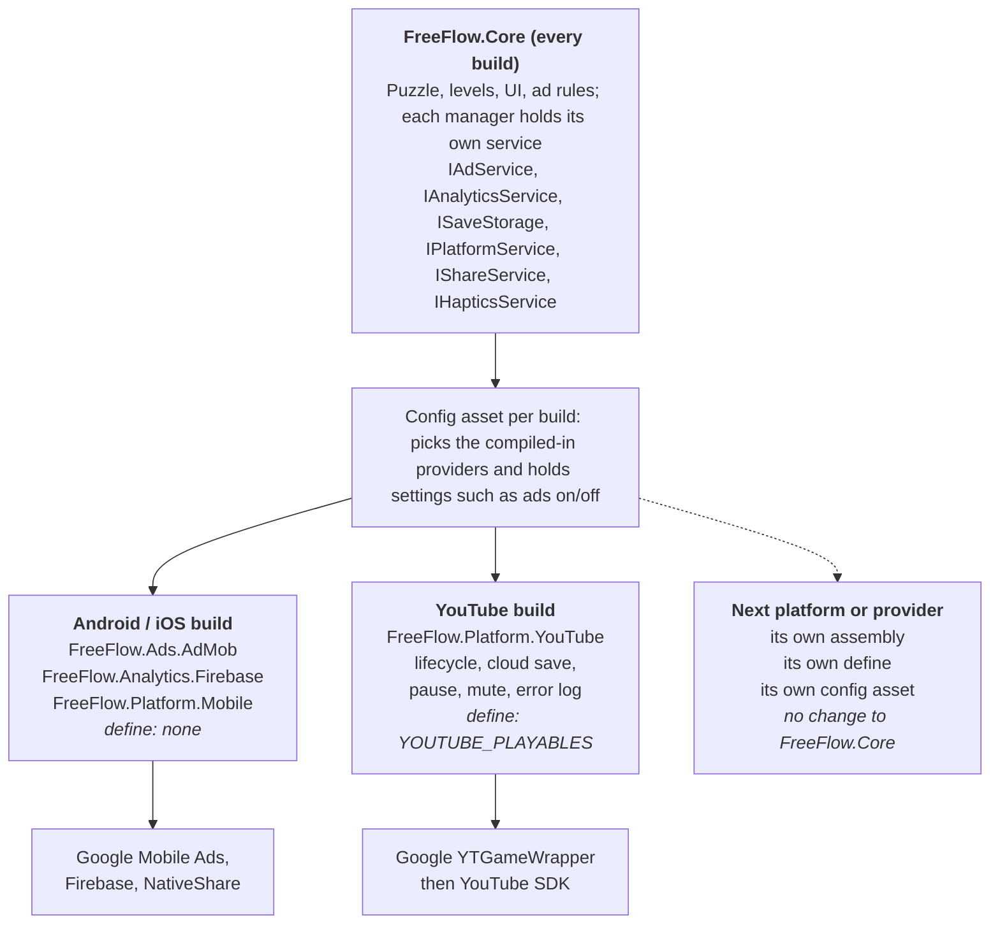

# FreeFlow — YouTube Playables Plan

As of 2026-10-07 · Live doc: https://claude.ai/code/artifact/c4263b7c-2842-4b64-80cc-bffae928956a

## Summary

FreeFlow can ship on YouTube Playables as a Unity WebGL build from the same project as the Android game. It uses Google's Unity wrapper and WebGL template, and swaps every mobile-only service for YouTube's SDK in that build only. Nothing below has been implemented yet; this plan restarts from the current committed code.

[YouTube Playables](https://developers.google.com/youtube/gaming/playables) are web games played inside the YouTube app and website on phones and desktops. Access is by invitation: a studio fills in the Playables interest form, then uploads a ZIP of the build through the [Developer Portal](https://developers.google.com/youtube/gaming/playables/developer_portal) for certification.

What the YouTube build has to change, in short:

1. **Build for the web** (Unity WebGL, uncompressed), with Google's WebGL template so YouTube's SDK loads before the game.
2. **Talk to YouTube through Google's Unity wrapper:** signal when the first frame and the menu are ready, obey YouTube's pause, resume and mute, and save to YouTube's cloud instead of files.
3. **Remove what YouTube forbids:** AdMob and Firebase, share buttons, the privacy-policy link, and any other way off the page. Only YouTube's own ads are permitted, and v1 will have none.
4. **Meet the size limits:** every file under 30 MiB and the download before the menu is playable under 30 MiB. A first test build had a 31.7 MiB code file.
5. **Work at every window shape** with touch and mouse, and tell the player when there is no more content.

The Android build stays as it is: YouTube-only code sits behind a `YOUTUBE_PLAYABLES` define that only the web build profile sets. Several choices need your answer before work starts; they are listed in the last section.

## YouTube Playables requirements

Certification checks eight areas. Every rule below is quoted or closely paraphrased from Google's pages, read on 2026-10-07; the Level column uses Google's own MUST / SHOULD / MAY wording.

| Area | Rule | Level | Source |
| --- | --- | --- | --- |
| Integration | Load the SDK (`https://www.youtube.com/game_api/v1`) before any game code | MUST | [Integration](https://developers.google.com/youtube/gaming/playables/certification/requirements_integration), [Getting started](https://developers.google.com/youtube/gaming/playables/reference/getting_started) |
| Integration | Call `firstFrameReady` when a loading or splash screen is rendering | MUST | Integration |
| Integration | Call `gameReady` only when the game is ready for interaction, never while non-interactable elements show | MUST | Integration |
| Integration | Call `saveData` after material progress; no other mechanism to save progress | MUST | Integration |
| Integration | Await `loadData` before calling `saveData`; load saves from previous versions without errors | MUST | Integration |
| Integration | Auto-save at milestones; the final flush save is best-effort and limited to 64 KiB | SHOULD | Integration |
| Integration | Respect YouTube mute with `isAudioEnabled` / `onAudioEnabledChange`, the device volume and system audio; no sound while YouTube mute is on | MUST | Integration |
| Integration | No internal master mute button; separate music/SFX controls are allowed | SHOULD NOT / MAY | Integration |
| Integration | Pause all execution after `onPause` and resume only on `onResume`; do not use the Page Visibility API | MUST | Integration |
| Integration | If `sendScore` is used, the best score sent matches the best score in the save | MUST if used | Integration |
| Stability | Download until `gameReady` under 30 MiB (SHOULD under 15 MiB) | MUST | [Stability](https://developers.google.com/youtube/gaming/playables/certification/requirements_stability) |
| Stability | Total bundle under 250 MiB; lazy-load what is not needed up front | MUST / SHOULD | Stability |
| Stability | Every file under 30 MiB (SHOULD under 512 KiB); at most 8,000 files; relative paths; filenames only letters, digits, `_ - .` | MUST | Stability |
| Stability | Save data under 3 MiB (SHOULD under 500 KiB) | MUST | Stability |
| Stability | Interactive in under 5 seconds | SHOULD | Stability |
| Stability | No reproducible crashes; peak JavaScript heap under 512 MB | MUST NOT exceed | Stability |
| Stability | Work in all browsers YouTube supports and in the YouTube Android and iOS apps | MUST | Stability |
| Design | Playable at all aspect ratios and adjust when the viewport changes (Google's examples: 9:32 to 32:9); otherwise centred with pillarbox or letterbox; no orientation lock; keep state on resize | MUST | [Design](https://developers.google.com/youtube/gaming/playables/certification/requirements_design) |
| Design | Touch and mouse for all interactions; keyboard for directional/text input; Esc closes dialogs; never `preventDefault()` on Esc | MUST / SHOULD | Design |
| Design | Text and graphics sharp at every resolution, aspect ratio and density | MUST | Design |
| Design | Tell the player when there is no more content | MUST | Design |
| Design | No in-game sharing prompts, no clickable external links, no extra user agreement, no exit/quit button, no icons identical to YouTube's close/mute/menu near them | MUST NOT | Design |
| Design | If haptics exist, a way to turn them off | MUST if used | Design |
| Monetization | No off-platform monetization, ads or purchases; ads only through YouTube's ad functions, configured in the Developer Portal | MUST NOT / MAY | [Monetization](https://developers.google.com/youtube/gaming/playables/certification/requirements_monetization) |
| Privacy | No external calls; no clipboard access except on paste; no personal data or login; no code obfuscation (minifying is fine) | MUST NOT | [Privacy and data](https://developers.google.com/youtube/gaming/playables/certification/requirements_privacydata) |
| Localization | Support English; language only from `getLanguage`, never `navigator.language` | MUST | [i18n](https://developers.google.com/youtube/gaming/playables/certification/requirements_i18n_l10n) |
| Trust and safety | Suitable for general audiences 13+, not made for kids; rights cleared for all IP, music and likeness; not identical to an existing Playable | MUST | [Trust and safety](https://developers.google.com/youtube/gaming/playables/certification/requirements_trustsafety) |
| Accessibility | Best effort toward WCAG AA; accurate accessibility tags | SHOULD / MUST NOT mislabel | [Accessibility](https://developers.google.com/youtube/gaming/playables/certification/requirements_accessibility) |

Four points from other pages matter for planning:

- **Ads are unclear today.** The monetization page opens with "Monetization is not supported within YouTube Playables" and "In-game advertising is strictly prohibited", yet its rules say games MAY use YouTube's ad functions. The Developer Portal says ad settings "won't change the end-user ads experience for now".
- **YouTube compresses files on submission.** Per the [Unity wrapper page](https://developers.google.com/youtube/gaming/playables/samples/unity_wrapper), a ~25 MiB `.wasm` becomes ~7 MiB, and that check covers the initial-download limit. A file over 30 MiB must be ZIP-compressed by us; Unity's own gzip/Brotli is not supported.
- **The SDK does nothing when served locally**, so real testing needs the YouTube dev link from the Developer Portal ([Getting started](https://developers.google.com/youtube/gaming/playables/reference/getting_started)).
- **YouTube serves the game with a strict Content Security Policy**; the [test suite guide](https://developers.google.com/youtube/gaming/playables/reference/test_suite_guide) gives the exact header to test against locally.

## Google's Unity wrapper and WebGL template

Google's [Experimental YouTube Playables Unity Wrapper](https://developers.google.com/youtube/gaming/playables/samples/unity_wrapper) covers every SDK call FreeFlow needs; the game still has to decide what to do with each one. Both packages come from Google's [web-game-samples](https://github.com/google/web-game-samples) repo (Apache 2.0) and were inspected on 2026-10-07.

| Package | Contents | Setup Google requires |
| --- | --- | --- |
| `GoogleYTGameWrapper.unitypackage` (4.7 KB) | `Assets/Plugins/UnityYTGameSDKLib.jslib`, `Assets/Scripts/YTGameSDK/YTGameWrapper.cs` | A GameObject named exactly `YTGameWrapper` in the main scene, with `YTGameWrapper.cs` on it; it persists across scenes by default |
| `Google-WebGLTemplate-only.unitypackage` (73 KB) | `Assets/WebGLTemplates/YTGameWrapperTemplate/` (index.html, loading bar, optional ZIP unpacker) | Select `YTGameWrapperTemplate` in Player Settings > WebGL; Compression Format set to Disabled |

Wrapper calls, mapped to the SDK:

| Wrapper method | SDK call |
| --- | --- |
| `SendGameFirstFrameReady()` / `SendGameIsReady()` | `game.firstFrameReady()` / `game.gameReady()` |
| `LoadGameSaveData(callback)` / `SendGameSaveData(string)` | `game.loadData()` / `game.saveData()` |
| `SetOnPauseCallback` / `SetOnResumeCallback` | `system.onPause` / `system.onResume` |
| `IsYTGameAudioEnabled()` / `SetOnAudioEnabledChangeCallback` | `system.isAudioEnabled` / `system.onAudioEnabledChange` |
| `RequestInterstitialAd()` / `RequestRewardedAd(id, callback)` | `ads.requestInterstitialAd` / `ads.requestRewardedAd` |
| `SendGameScore(int)` | `engagement.sendScore` |
| `SendYTGameError` / `SendYTGameWarning` | `health.logError` / `health.logWarning` |
| `InPlayablesEnv()` | `IN_PLAYABLES_ENV` |

Not in the wrapper: `getLanguage` and `openYTContent`.

What the packages leave to the game, from reading their source:

- **Pause stops nothing by itself.** The wrapper only calls the game's callback; Google's example sets a `gameIsPaused` flag. Unity's web runtime keeps running and rendering unless the game stops it.
- **Save and interstitial results are not real.** `SendGameSaveData` and `RequestInterstitialAd` return an int, but the JavaScript returns before YouTube answers, so the value says nothing about success.
- **A failed `loadData` never answers.** There is no error path, so the game needs its own timeout or startup could wait forever.
- **In the Editor, `RequestRewardedAd` always reports the reward as earned**, so Editor tests must not trust it.
- **The template never calls `firstFrameReady`**; the game calls it through the wrapper.
- **The template stretches the game to fill any window shape**; it has no pillarbox or letterbox.
- **The template's page title is "YT Game Wrapper WebGL Template"** and its loading screen shows the Unity logo.

## Gap analysis: the Android game today

Firebase stops a web build compiling; file saves, missing SDK signals and forbidden UI stop certification; the puzzle itself, the 1,066 levels, the page system and audio carry over. Facts below were checked against the code on Unity 6000.3.8f1 (Built-in pipeline, legacy Input Manager).

| Part | Today (checked in code) | YouTube build needs | Blocks |
| --- | --- | --- | --- |
| Firebase Analytics + Crashlytics | `FirebaseManager.cs`, `AnalyticsManager.cs`, unguarded; Firebase DLLs exclude WebGL | Compiled out; errors could go to `SendYTGameError` | Compile |
| AdMob | `ADManager.cs`: rewarded ad when hints are 0 (`GameplayPage.cs:341`), interstitial after 3 levels and 120 s (scene value; the code default is 180 s) (`UIController.cs:737`); four core AdMob DLLs are set to Any Platform | Compiled out; four DLLs excluded from WebGL; no ads in v1 | Policy |
| Saving | `ProfileManager.cs`: `SaveData.json` + `Settings.json` written with `System.IO` | Cloud save through the wrapper, loaded before the first save, saved after progress and on pause | Certification |
| Startup signals | StartScene runs ProfileManager, AdManager, FirebaseManager, then loads MainScene; no SDK calls | `firstFrameReady` on the first frame, `gameReady` once the main menu is interactive | Certification |
| Pause / resume | Nothing handles either | Stop the game on `onPause`, restart on `onResume` (freeze, save, stop the frame loop) | Certification |
| Audio | `AudioManager.cs`: music starts in `Start`; music and SFX sliders; no master mute | YouTube mute silences everything; sliders stay | Certification |
| Share | Settings row `Row_Share` and Level Complete `ShareBtn` use NativeShare | Hidden | Certification |
| Privacy policy | Settings row `Row_Privacy`, no click handler | Hidden (no external links) | Certification |
| Vibration | `Haptics.cs` is already a no-op on WebGL; Settings shows `Row_Vibration` | Hidden, since it would do nothing | Minor |
| Settings and Level Complete layout | Rows and buttons are hand-positioned, no layout groups | Close the gaps the hidden rows leave | Minor |
| Esc key and Android back | No Esc or back handling anywhere, so Android's back button does nothing | Every platform: close the top popup, else go back one page; nothing on the main menu; from a board, back to the level list (the daily calendar for a daily challenge); on Level Complete, close it | SHOULD on YouTube; new on Android |
| End of content | Last pack level says "PACK COMPLETE"; nothing says all content is done | "ALL PACKS COMPLETE" | Certification |
| Window shape | Portrait layout; `CanvasScalerMatchSetter` covers 9:19.5 to 3:4; orientation Portrait | Pillarbox inside Unity | Certification |
| Hints | 3 at start; refilled only by the rewarded ad (also by the Developer page and Reset) | +1 hint the first time each day's challenge is solved | Decided |
| Developer page | Gated by `FINAL_BUILD`, which is defined nowhere, so it shows in every build | Define `FINAL_BUILD` for the YouTube submission | Minor |
| Frame rate | `AppBootstrap.cs` sets 60 fps | Leave the web loop to the browser (`-1`) on WebGL | Minor |
| Daily challenge | Fixed level per UTC date from the device clock | No change | None |
| Language | English only, hard-coded | Passes (English is required) | None |

Size, measured on a test build (since reverted) with today's code and settings:

| File | Raw | gzip | Limit |
| --- | --- | --- | --- |
| `.wasm` (code) | 31.73 MiB | 9.00 MiB | Over the 30 MiB per-file MUST |
| `.data` (assets) | 9.61 MiB | 5.02 MiB | OK |
| Download until playable | 41.8 MiB | ~14.1 MiB | Depends on how YouTube measures; Google's note says submissions are compressed |

Likely contributors, from that build's report: code optimization stored as 0 (likely "Shorter Build Time", not confirmed), managed stripping Low, the Unity splash logo (2.7 MiB), TextMesh Pro's default font and emoji sprites (~1.7 MiB), three Teko font weights (1 MB each), and `bg-music` (1.5 MiB built). Nothing here is fixed yet.

**Phase 4 baseline, 2026-10-08.** Clean, non-development build of the YouTube Playables profile after Phases 0–3 (AdMob and Firebase compiled out). Settings at the time: compression Disabled, data caching on, managed stripping Low, Strip Engine Code on, IL2CPP Release with Optimize Speed, code optimization read as Runtime Speed, splash screen off, memory 32 MB initial / 2048 MB max.

| File | Raw | gzip -9 | Brotli 11 | Limit |
| --- | --- | --- | --- | --- |
| `.wasm` (code) | 31.76 MiB | 8.97 MiB | 5.97 MiB | Over the 30 MiB per-file MUST |
| `.data` (assets) | 9.64 MiB | 5.04 MiB | 4.42 MiB | OK |
| `.framework.js` | 0.40 MiB | 0.09 MiB | 0.07 MiB | OK |
| `.loader.js` | 0.03 MiB | 0.01 MiB | 0.01 MiB | OK |
| Whole build, 22 files | 41.98 MiB | | | Download until playable is essentially all of it |

Assets in the `.data` (Unity's report, uncompressed): textures 15.3 MB, other assets 2.6 MB, sounds 1.6 MB, shaders 38 KB; 19.7 MB of user assets in a 42.0 MB build. Largest single items: the Unity splash logo texture 2.7 MB (included although the splash is off), `bg-music.wav` 1.5 MB, LiberationSans SDF and the three Teko SDF fonts 1.0 MB each, the gameplay sprite atlas 1.0 MB, `bg_light_1080x1920.png` 1.0 MB, TextMesh Pro's `LiberationSans.ttf` 0.34 MB and `EmojiOne.png` 0.34 MB, nine `board_grid_*` sprites and five other UI sprites ~0.26 MB each.

Also found: `Assets/StreamingAssets/google-services-desktop.json` (Firebase's config file) is copied into the YouTube build, although Firebase is compiled out of it.

**After removing the splash logo, LiberationSans and EmojiOne, 2026-10-08.** "Show Unity Logo" unticked; TMP's default font set to Teko-Medium (Teko's atlases regenerated with "·"); LiberationSans, its fallback and materials, and EmojiOne moved out of TMP's `Resources`.

| File | Raw | gzip -9 | Brotli 11 | Change from baseline (raw) |
| --- | --- | --- | --- | --- |
| `.wasm` (code) | 31.76 MiB | 8.97 MiB | 5.97 MiB | none |
| `.data` (assets) | 8.92 MiB | 4.42 MiB | 3.87 MiB | −0.72 MiB |
| Whole build, 22 files | 41.27 MiB | | | −0.71 MiB |

Unity's report counts user assets falling from 19.7 MB to 15.3 MB, but its sizes are before compression: inside `.data`, every asset is in `data.unity3d`, a bundle Unity already compresses with LZ4HC. What `.data` actually holds:

| Inside `.data` | Size | What it is |
| --- | --- | --- |
| `Il2CppData/Metadata/global-metadata.dat` | 4.09 MiB | Code metadata; grows and shrinks with the code, like the `.wasm` |
| `data.unity3d` | 1.72 MiB | All scenes, textures, fonts and sprites, LZ4HC-compressed |
| `Resources/unity default resources` | 1.56 MiB | Unity's built-in resources |
| `sharedassets1.resource` | 1.55 MiB | Audio stored for streaming (mainly `bg-music`) |

So art and fonts are a small part of the download. Code is most of it: the `.wasm` plus its metadata come to about 35.9 MiB of the 41.3 MiB.

**After removing unused packages, 2026-10-08.** Removed from `Packages/manifest.json` (project-wide, so Android too): Visual Scripting, 2D Animation, 2D PSD Importer, 2D SpriteShape, 2D Pixel Perfect, 2D Tilemap Editor, Timeline, AI Navigation, Multiplayer Center; Burst, Collections, Mathematics and 2D Common went with them as dependencies. `com.unity.2d.sprite` (the Sprite Editor, needed for the 17 nine-slice sprites) added explicitly so it stays. Nothing in the project used any of them; no missing scripts afterwards, and the Editor needed a restart for Burst.

| File | Raw | gzip -9 | Brotli 11 | Change from previous (raw) |
| --- | --- | --- | --- | --- |
| `.wasm` (code) | 31.26 MiB | 8.86 MiB | 5.84 MiB | −0.50 MiB |
| `.data` (assets) | 8.74 MiB | 4.33 MiB | 3.80 MiB | −0.18 MiB (code metadata 4.09 → 3.96 MiB) |
| Whole build, 22 files | 40.58 MiB | | | −0.69 MiB |

Assemblies in the build fell from 108 to 87. Apart from Unity's engine modules, what is left is DOTween (+ Modules), FreeFlow.Core, FreeFlow.Platform.YouTube, YTGameSDK, TextMesh Pro, NativeShare.Runtime, and the Unity MCP plugin's runtime with Newtonsoft.Json. The small saving shows that Low stripping was already removing most of those packages' code; the `.wasm` is still over 30 MiB.

**After the Web-only code-size settings, 2026-10-08.** Managed Stripping Level Low → High and IL2CPP Code Generation Optimize Speed → Optimize Size (both set for the Web target only; Android and iOS stay Low / Optimize Speed), and the YouTube Playables profile's Code Optimization Runtime Speed → Disk Size with LTO. The clean build took about 9 minutes.

| File | Raw | gzip -9 | Brotli 11 | Change from previous (raw) |
| --- | --- | --- | --- | --- |
| `.wasm` (code) | **17.11 MiB** | 6.21 MiB | 4.49 MiB | −14.15 MiB |
| `.data` (assets) | 8.08 MiB | 4.14 MiB | 3.65 MiB | −0.66 MiB (code metadata 3.96 → 3.30 MiB) |
| `.framework.js` | 0.39 MiB | 0.08 MiB | 0.07 MiB | |
| Whole build, 22 files | **25.77 MiB** | | | −14.81 MiB |

Every file is now under the 30 MiB per-file MUST, and the whole build is under 30 MiB even before YouTube compresses it, so no ZIP step is needed.

Played in a local browser (Chromium, served from `127.0.0.1`) to check High stripping removed nothing the game needs: boots to the main menu; Classic → 5×5 → level 1; drawing paths; a hint (3 → 2); solving to Level Complete (Share hidden, "·" drawn in Teko); Esc closing Level Complete, then back to the level list, the pack list and the main menu; Settings with the vibration, share and privacy rows hidden; the daily calendar, today's daily board, and Esc back to the calendar. No console errors. Advanced-mode mechanics, the developer page and audio were not exercised.

## Approach

Game code talks only to service interfaces. Each platform's SDK code lives in its own assembly, switched on or off by the build profile's define, and a config asset per build picks which compiled-in provider serves each interface. Adding a provider later (another ad network, another web portal) means a new assembly and a config entry, with no change to the game code. Google's wrapper and template are used as shipped.

Assemblies (Unity assembly definitions), and when each is compiled:

| Assembly | Holds | Compiled |
| --- | --- | --- |
| `FreeFlow.Core` | Gameplay, UI, levels, ad rules, the service interfaces, the managers that each own one service (ADManager, AnalyticsManager, ProfileManager, ShareService, Haptics, PlatformManager), config types, null providers, device-file save storage | Always |
| `FreeFlow.Editor` | The tools in `Assets/FreeFlow/Script/Editor` (level generator, pack verifier and others) | Editor only |
| `FreeFlow.Ads.AdMob` | `IAdService` on Google Mobile Ads | Without `YOUTUBE_PLAYABLES` |
| `FreeFlow.Analytics.Firebase` | `IAnalyticsService` on Firebase Analytics and Crashlytics | Without `YOUTUBE_PLAYABLES` |
| `FreeFlow.Platform.Mobile` | `IShareService` (NativeShare), `IHapticsService` (Android and iOS vibration), `IPlatformService` | Without `YOUTUBE_PLAYABLES` |
| `FreeFlow.Platform.YouTube` | `IPlatformService`, `ISaveStorage` (cloud save), `IAnalyticsService` (error log), all on Google's wrapper | With `YOUTUBE_PLAYABLES` |
| DOTween Modules | DOTween's module scripts, so Core can still use tweens such as `DOFade` | Always |
| Google's wrapper | `YTGameWrapper.cs`, unmodified, with an `.asmdef` file added beside it | Always (its own code keeps the SDK calls to web builds; only `FreeFlow.Platform.YouTube` references it) |

The last two exist because code inside an assembly definition cannot reference loose scripts: DOTween's modules and Google's wrapper are both loose today. DOTween's setup panel can create its modules assembly; Google's files would only gain a new file next to them (Q13).

Which provider serves each interface:

| Interface | Android / iOS | YouTube | Default when none is set |
| --- | --- | --- | --- |
| `IAdService` | AdMob | None in v1 | No ads |
| `IAnalyticsService` | Firebase Analytics + Crashlytics | YouTube error log only | Nothing recorded |
| `ISaveStorage` | Device files (in Core) | YouTube cloud save | Device files |
| `IPlatformService` | Mobile: no YouTube signals; behaves as today | Ready signals, pause/resume, mute, language | No-op |
| `IShareService` | NativeShare | None | Not available |
| `IHapticsService` | Native vibration | None | Off |

Rules that keep the design extensible and the Android build unchanged:

1. **Refactor first, then add YouTube.** The Android build moves onto the interfaces with no change in behaviour before any YouTube code lands.
2. **Rules live in Core, providers only deliver.** The interstitial cadence (3 levels, 120 s), when a rewarded ad is offered and what it pays stay in Core; an ad provider only loads, shows and reports the result.
3. **The UI asks services, not platforms.** For example the Share row shows only when `IShareService` says sharing is available, so a new platform needs no UI change.
4. **Google's files stay as Google ships them.** Gaps found in their source (fake save results, no load timeout, Editor reward stub, pause that stops nothing) are handled inside `FreeFlow.Platform.YouTube`.
5. **One save format.** The same progress and settings JSON goes to device files on Android and to YouTube cloud save on the web.
6. **Plugin import settings, not deletions.** Mobile SDK DLLs are excluded from WebGL in their import settings; no package is removed.
7. **Check Android before each commit** with an Android build and a quick play-through.

Each build finds its config through one asset per define, loaded from Resources. Google's `YTGameWrapper` object sits in StartScene, where saves are loaded, and stays alive into MainScene (the wrapper's default).

**Edit each config on its own build profile.** A provider asset's script lives in its provider assembly, so while the other profile is active that script is not compiled and the Inspector shows the provider fields as None. The references are still on disk. `ServiceConfig_Mobile` and the assets in `Assets/FreeFlow/Settings/Services/Mobile` are edited with the Android or iOS profile active; `ServiceConfig_YouTube` and `Assets/FreeFlow/Settings/Services/YouTube` with the YouTube Playables profile active.

## Work plan

Six phases of work in Unity, none of which needs the Developer Portal; portal access runs alongside as its own track (below the table). Phase 1 restructures the Android game onto the service layer before any YouTube code is added. Each phase lists what it still waits on. No time estimates, by your choice.

| # | Phase | Tasks | Done when | Waits on |
| --- | --- | --- | --- | --- |
| 0 | Setup | Create the Web build profile with `YOUTUBE_PLAYABLES`. Import Google's wrapper and template packages unmodified. | The profile exists; the Android build is unchanged | Nothing |
| 1 | Service layer (Android only) | Create the assemblies (Core, Editor, DOTween Modules, one per provider) and the `.asmdef` beside Google's wrapper. Add the six interfaces and null providers; each manager holds its own service, built from the one config asset per define in Resources. Move AdMob, Firebase, NativeShare, haptics and file saving into providers; move the ad rules into Core. Exclude the four core AdMob DLLs from WebGL. | The Android build behaves exactly as before; edit-mode tests pass; a web build compiles with no mobile SDK code | Nothing |
| 2 | YouTube SDK integration | Build `FreeFlow.Platform.YouTube` on Google's wrapper: the `YTGameWrapper` scene object in StartScene; `firstFrameReady` and `gameReady`; cloud save (load before any save, a load timeout, save after progress and on pause); pause (freeze time, audio and input, save, stop the frame loop with Unity's `pauseMainLoop`; on resume restart it and turn input back on a frame later); YouTube mute; error log; browser-driven frame rate on WebGL. No ads. | Works in the Editor and a local web build; confirmed on the YouTube dev link once portal access exists (save survives a reload, pause stops the game, mute silences it) | Nothing to start; portal access to confirm |
| 3 | Rules and UI | **Done 2026-10-07, except the pillarbox (deferred).** Hide the Settings share row, the Level Complete share button, the privacy-policy row and the vibration row, and move the rest up. Pillarbox inside Unity for very wide and very tall windows. "ALL PACKS COMPLETE" once every pack is done. +1 hint the first time each day's challenge is solved. `FINAL_BUILD` for the submission build. Esc and Android back on every platform (shared code, so Android gets it too). | Every Design and Monetization rule in the requirements table checked by hand | Nothing |
| 4 | Size and performance | Measure the build, then choose: shrink it (stripping, code optimization, splash, unused fonts and emoji, music), ZIP the `.wasm` as Google describes, or both. Keep the heap well under 512 MB. Aim for interactive in under 5 s. | All Stability MUSTs met on a measured build | The measurement |
| 5 | Test and submit | Run the testing checklist on the YouTube dev link. Portal release: Claude drafts the title, description and accessibility tags, your team makes the thumbnails, ads stay off. Submit for certification. | Submitted | Portal access, licences confirmed |

**Portal access (parallel track).** Development does not need the Developer Portal. It is needed for three things: testing on YouTube itself (the SDK does nothing on a local build, so cloud save, pause, mute and ads can only be confirmed there), the Test Suite, and uploading and submitting. Access is by invitation, so apply through the Playables interest form early; the studio had not applied yet on 2026-10-07.

Every phase that touches shared code ends with an Android build and a quick play-through before it is committed.

## Testing and submission

The SDK does nothing when the game is served locally, so local tests cover the game and the security policy; YouTube behaviour is tested on the Developer Portal's dev link.

| Where | How | Checks |
| --- | --- | --- |
| Unity Editor | Play mode | Game runs with AdMob and Firebase compiled out; hidden rows and layout; Esc and back |
| Local browser | WebGL build on a local server, with Google's CSP header applied through Chrome local overrides ([guide](https://developers.google.com/youtube/gaming/playables/reference/test_suite_guide)) | No CSP violations; no external requests; window resizing |
| Test Suite | [SDK Test Suite](https://developers.google.com/youtube/gaming/playables/test_suite) | Not yet known: the page shows nothing without access (Q1) |
| YouTube dev link | Developer Portal release, "Verify and test" tab | YouTube desktop web, mobile web, Android app, iOS app |

To check on the dev link:

- [ ] Loading screen shows, then the main menu; YouTube's spinner clears only once the menu is usable
- [ ] First launch, play, reload: pack progress, daily completions, hints and settings come back
- [ ] A save from the previous build loads without errors
- [ ] Pause during a level: nothing moves, no sound, taps are ignored; resume continues cleanly
- [ ] YouTube mute: no sound anywhere, whatever the in-game sliders say
- [ ] Every window shape from very tall to very wide: playable, nothing cut off, no state lost on resize
- [ ] Touch only, then mouse only, for every flow
- [ ] Esc (and back on Android): closes the top popup, else goes back one page; nothing on the main menu; from a board back to the level list (daily calendar for a daily challenge); on Level Complete closes it
- [ ] No share, privacy-policy or vibration controls
- [ ] Finishing all content shows the end-of-content message
- [ ] Android build from the same commit still has ads, share, haptics and Firebase, and its back button behaves as above

Before pressing "Submit for Certification" in the portal (only one release can be in review at a time):

- [ ] Title, genre, description, publisher and developer filled in; no logos or branding in thumbnails, titles or descriptions
- [ ] Thumbnails in every aspect ratio the portal asks for
- [ ] Accurate accessibility tags
- [ ] Rights confirmed for all art, fonts, music and sounds; general audience 13+, not made for kids
- [ ] Ads left off in the portal (no ads in v1)
- [ ] ZIP of the uncompressed WebGL build, every file under 30 MiB
- [ ] `FINAL_BUILD` added to the YouTube Playables profile's Scripting Defines for the submission build (and removed afterwards), so the Developer page is gone
- [ ] Dev and staging links kept inside the team

## Decisions and open questions

All questions are answered except the one below. Decisions recorded on 2026-10-07:

| Topic | Decision |
| --- | --- |
| Branch | Same branch as the Android game |
| Wrapper and template | Google's wrapper and Google's WebGL template, both unmodified (its page title and Unity logo included) |
| Code structure | Interfaces for ads, analytics, save storage, platform lifecycle, share and haptics; one assembly definition per provider; providers chosen by build profile plus a config asset |
| Config selection (Q12) | One config asset per define, loaded from Resources |
| Wrapper assembly (Q13) | Add an `.asmdef` beside Google's wrapper files; their files untouched |
| Wrapper object (Q2) | `YTGameWrapper` as a scene object in StartScene |
| Pause (Q3) | Freeze time, audio and input, save, then stop Unity's frame loop with its built-in `pauseMainLoop` (a two-line `.jslib`); on resume restart the loop and turn input back on a frame later |
| Ads (Q4) | No ads in the YouTube build for v1 |
| Hints (Q5) | +1 hint the first time each day's challenge is solved, YouTube build only: `dailyFirstSolveHints` on the config asset, 1 for YouTube and 0 for Mobile |
| Window shape (Q6) | Pillarbox inside Unity: a centred portrait game area with bars; template untouched. Deferred out of Phase 3 on 2026-10-07 ("skip UI changes for now"); still needed for certification |
| Hidden UI (Q7) | Settings share row, Level Complete share button, privacy-policy row and vibration row; the rest moves up to close the gaps. Each asks its service: `IShareService.IsAvailable`, `IHapticsService.IsSupported`, and `IPlatformService.CanOpenExternalLinks` for the privacy row |
| End of content (Q8) | "ALL PACKS COMPLETE" on every platform, in place of "PACK COMPLETE" when the last unfinished pack of either mode is finished |
| Size (Q9) | Decided in Phase 4 from a measured build |
| Language and score (Q10) | English only; no `sendScore` |
| Listing (Q10) | Claude drafts the title, description and accessibility tags for your review; your team makes the thumbnails |
| Developer page | `FINAL_BUILD` set for the YouTube submission build: added to the YouTube Playables profile's Scripting Defines for that build only, then removed, as for the store builds |
| Portal access (Q1) | Not applied yet; development goes ahead meanwhile |
| Estimates (Q11) | None |
| Esc and Android back | Every platform: close the top popup, else go back one page; nothing on the main menu; from a board, back to the level list (the daily calendar for a daily challenge); on Level Complete, close it |

Still open:

- [ ] **Licences.** Music, sound effects and fonts must be cleared for distribution on YouTube; not yet confirmed. Needed before submission.
